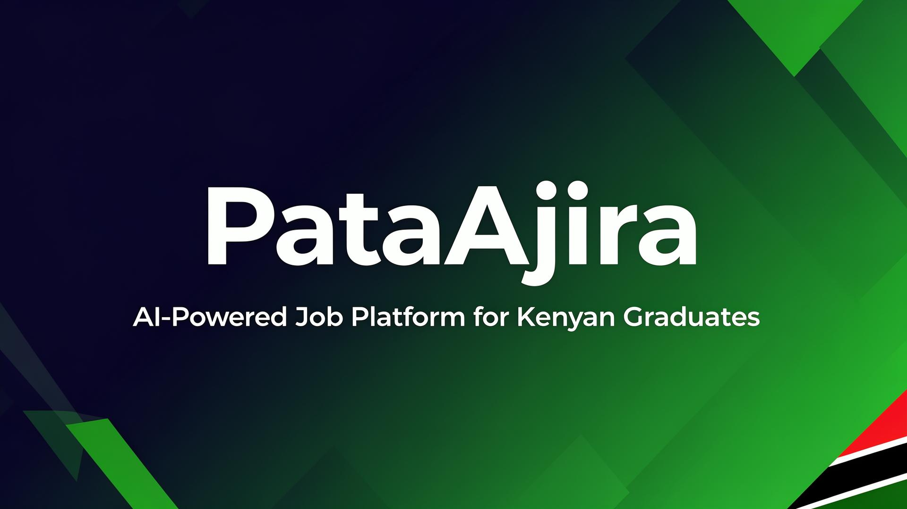
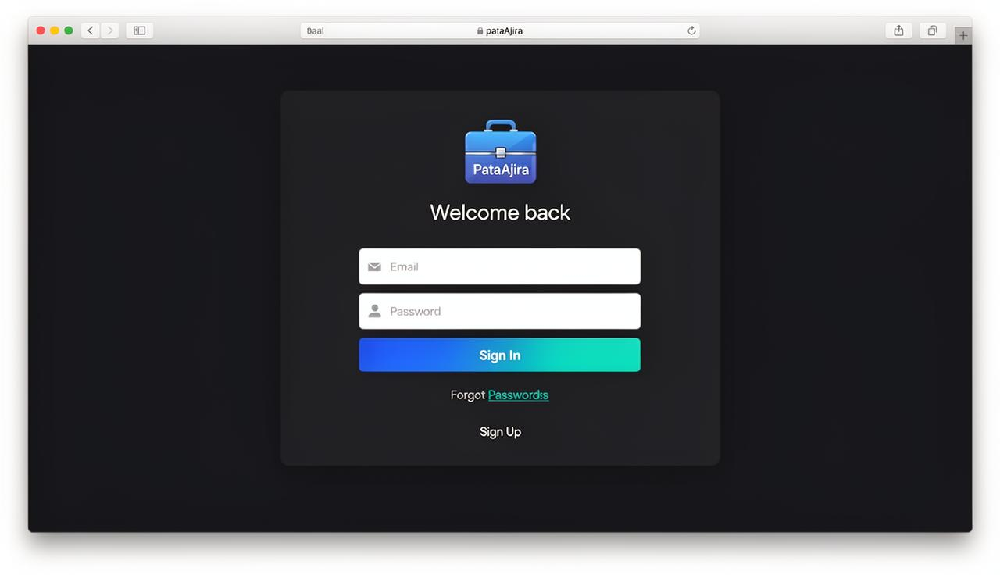
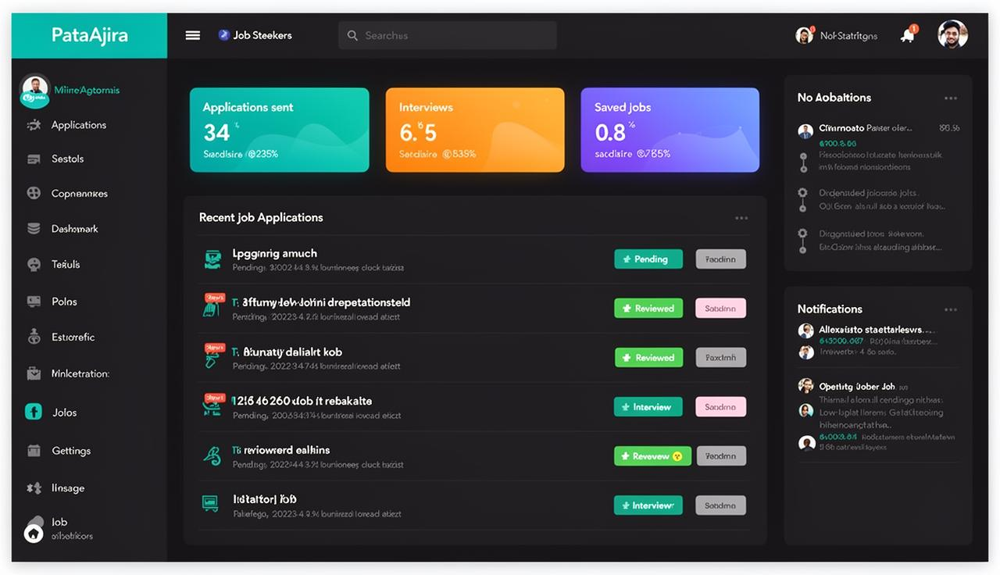
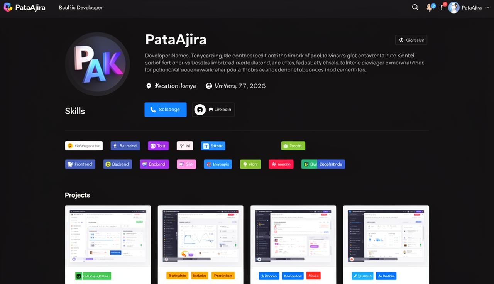
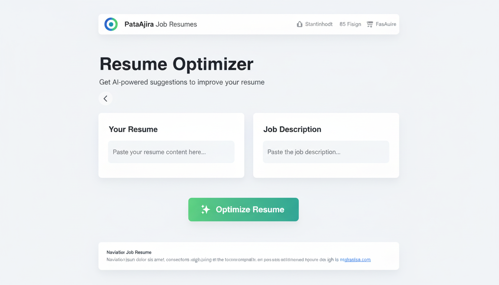
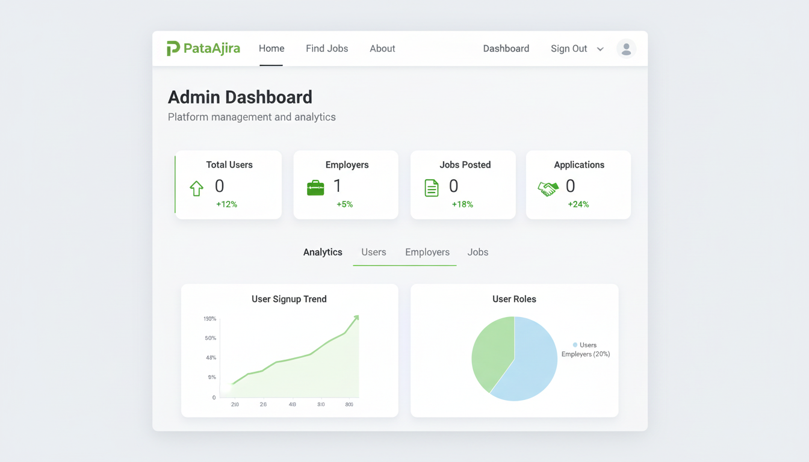

# 🚀 PataAjira — AI-Powered Job Platform for Kenyan Graduands



**PataAjira** is a full-stack web application designed to help Kenyan university graduands discover internships and entry-level jobs. It features AI-powered resume optimization, skill gap detection, GitHub portfolio analysis, and real-time job alerts — all in one modern platform.

🔗 **Live Demo:** [https://pataajira.lovable.app](https://pataajira.lovable.app)

---

## 📋 Table of Contents

- [Features](#-features)
- [Tech Stack](#-tech-stack)
- [Screenshots](#-screenshots)
- [Installation](#-installation)
- [Environment Variables](#-environment-variables)
- [Admin Dashboard](#-admin-dashboard)
- [Security & Best Practices](#-security--best-practices)
- [My Contributions](#-my-contributions)
- [Contact](#-contact)
- [License](#-license)

---

## ✨ Features

### Job Seeker Features

| Feature | Description |
|---|---|
| 🤖 **AI Resume Optimizer** | Upload your resume and get AI-powered suggestions to improve it for specific job postings |
| 📊 **Skill Gap Detector** | Identify missing skills for your target roles with personalized learning recommendations |
| 🔔 **Smart Job Alerts** | Automatic notifications when new jobs match your skills, interests, or location |
| 🐙 **GitHub Portfolio Analyzer** | Connect your GitHub to showcase projects and get profile strength insights |
| 📝 **Application Tracker** | Track all your job applications with real-time status updates |
| 👤 **Public Developer Profile** | A shareable profile page highlighting your skills, projects, and experience |
| 💌 **AI Cover Letter Generator** | Generate tailored cover letters for specific job applications |
| 🎤 **Interview Practice** | AI-driven mock interview sessions to prepare for real interviews |

### Employer Features

| Feature | Description |
|---|---|
| 📢 **Job Posting** | Create and manage job listings with required skills and descriptions |
| 📈 **Applicant Management** | Review, rank, and manage candidate applications |
| ✅ **Employer Verification** | Verified employer badges for trusted companies |

### Admin Features

| Feature | Description |
|---|---|
| 🛡️ **Admin Dashboard** | Full platform analytics with user, employer, and job management |
| 🏆 **Candidate Ranking** | AI-assisted candidate scoring and ranking for employers |
| 📋 **Job Post Moderation** | Approve or reject job postings before they go live |
| 👥 **User Role Management** | Secure role assignment (student, employer, admin) |

---

## 🛠 Tech Stack

| Layer | Technology |
|---|---|
| **Frontend** | React.js, TypeScript, Tailwind CSS, shadcn/ui, Framer Motion |
| **Backend** | Lovable Cloud (Supabase), Edge Functions, PostgreSQL |
| **AI Tools** | Lovable Cloud AI (Resume Optimization, Skill Gap Analysis, Interview Practice) |
| **Authentication** | JWT-based auth with email verification |
| **State Management** | TanStack React Query |
| **Charts** | Recharts |
| **Routing** | React Router v6 |
| **Deployment** | Lovable Cloud |

---

## 📸 Screenshots

### Login Page


### Job Seeker Dashboard


### Developer Profile


### AI Resume Optimizer


### Admin Dashboard


---

## ⚙️ Installation

### Prerequisites

- **Node.js** v18+ and **npm** v9+
- Git

### Steps

```bash
# 1. Clone the repository
git clone https://github.com/your-username/pataajira.git

# 2. Navigate to the project directory
cd pataajira

# 3. Install dependencies
npm install

# 4. Create a .env file with the required variables (see below)
cp .env.example .env

# 5. Start the development server
npm run dev
```

The app will be available at `http://localhost:5173`.

---

## 🔐 Environment Variables

Create a `.env` file in the root directory with the following placeholders:

```env
VITE_SUPABASE_URL=your_supabase_url_here
VITE_SUPABASE_PUBLISHABLE_KEY=your_supabase_anon_key_here
VITE_SUPABASE_PROJECT_ID=your_project_id_here
```

> ⚠️ **Never commit real API keys or secrets.** The `.env` file is included in `.gitignore`.

---

## 🛡️ Admin Dashboard

The admin dashboard provides full platform management capabilities. Access is controlled through **secure, server-side role-based access control (RBAC)**.

### How It Works

1. **Roles are stored in a separate `user_roles` table** — never on the user profile
2. **Role checks use a `SECURITY DEFINER` function** (`has_role`) that bypasses RLS recursion
3. **Row-Level Security (RLS)** policies enforce access at the database level
4. **Admin actions** (role changes, employer verification) go through authenticated Edge Functions

### Accessing the Admin Dashboard

1. Sign in with an account that has the `admin` role assigned in the `user_roles` table
2. The dashboard automatically renders based on your role
3. Admin features include: user management, employer verification, job moderation, and analytics

> ⚠️ Admin status is **never** checked via client-side storage. All role verification happens server-side.

---

## 🔒 Security & Best Practices

- ✅ **Email Verification** — Users must verify their email before accessing the platform
- ✅ **JWT Authentication** — Secure token-based authentication via Supabase Auth
- ✅ **Row-Level Security (RLS)** — All database tables protected with granular RLS policies
- ✅ **Security Definer Functions** — Role checks avoid RLS recursion with `SECURITY DEFINER`
- ✅ **No Secrets in Code** — All sensitive keys stored in environment variables
- ✅ **File Upload Validation** — Resume and avatar uploads validated for type and size
- ✅ **Input Sanitization** — Form inputs validated with Zod schemas
- ✅ **Protected Routes** — Client-side route guards with server-side verification

---

## 👨‍💻 My Contributions

**Mohammed Johar** — Full-Stack Developer

- 🏗️ **Architecture & Design** — Designed the complete system architecture, database schema, and component hierarchy
- ⚛️ **Frontend Development** — Built all React components, pages, and responsive UI with Tailwind CSS and shadcn/ui
- 🔧 **Backend Development** — Implemented database tables, RLS policies, Edge Functions, and real-time triggers
- 🤖 **AI Integrations** — Integrated AI-powered resume optimization, skill gap detection, cover letter generation, and interview practice
- 🐙 **GitHub Integration** — Built GitHub portfolio analyzer for developer profile enrichment
- 🔐 **Authentication & Security** — Implemented secure auth flow with email verification and role-based access control
- 🚀 **Deployment** — Deployed and maintained the production application on Lovable Cloud

---

## 📬 Contact

| | |
|---|---|
| **Name** | Mohammed Johar |
| **Email** | [darweshmohammed17@gmail.com](mailto:darweshmohammed17@gmail.com) |
| **Phone** | 0716729803 |
| **GitHub** | [github.com/mjohar-dev/](https://github.com/mjohar-dev/) |
| **LinkedIn** | [linkedin.com/in/www.linkedin.com/in/mohammed-johar-308b96232](https://linkedin.com/in/www.linkedin.com/in/mohammed-johar-308b96232) |
| **Portfolio** | [pataajira.lovable.app](https://pataajira.lovable.app) |

---

## 📄 License

This project is built for educational and portfolio purposes. All rights reserved © 2026 Mohammed Johar.

---

<p align="center">
  Built with ❤️ in Kenya using <a href="https://lovable.dev">Lovable</a>
</p>
